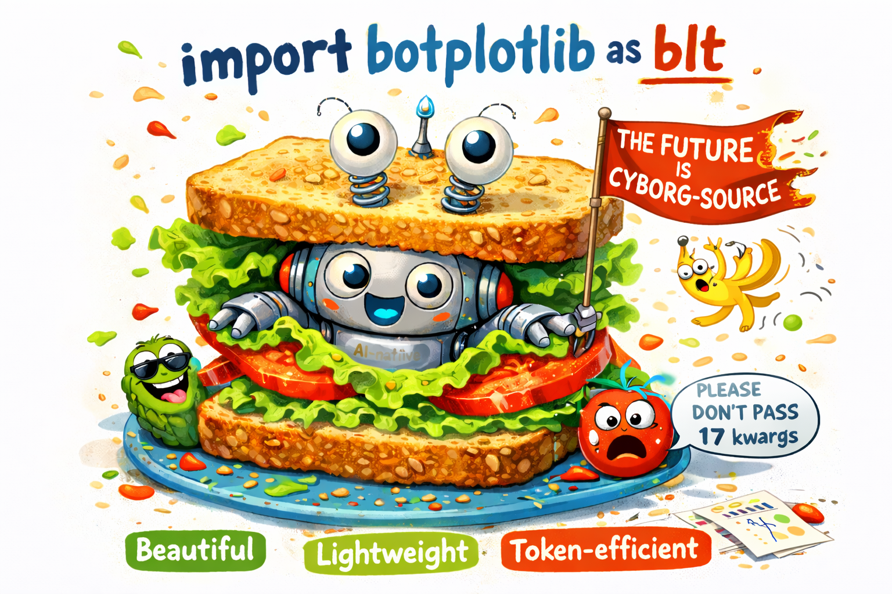

# botplotlib

Matplotlib has fed the scientific Python community for two decades. botplotlib is designed for a workflow that didn't exist when matplotlib was born: a human has an idea or a request, and then an AI + human team jointly creates it, iterating until both are satisfied. 

```python
import botplotlib as bpl
```

<p align="center">
  
</p>

The core principles:

- **Beautiful by default** — themes designed so the first render is more often the final render
- **Lightweight** — `bpl.scatter(data, x="a", y="b")` and you're done
- **Token-efficient** — 1 line instead of 15. Fewer tokens, fewer places to go wrong

Botplotlib is also an experiment in cyborg-source. What does open-source collaboration look like when some of the collaborators are AI? We don't know but we put a bunch of ideas in [GOVERNANCE.md](GOVERNANCE.md). It is wildly over-engineered for our current contributor count. 

## Cyborg Social Contract

Humans and AIs contribute under the same rules.

1. **All contributions are cyborg** — the human/machine binary is rejected
2. **Quality gates are structural** — CI/tests/linters apply equally regardless of origin
3. **No moral crumple zones** — fix the system, don't blame the nearest human
4. **Social trust is emergent** — reputation through contribution quality, not biological status
5. **Provenance is transparent but not punitive** — metadata for learning, not gatekeeping
6. **The project is the cyborg** — the library itself is the human-machine hybrid

For the full architecture overview, design principles, and module map, see [AGENTS.md](https://github.com/migdaepp/botplotlib/blob/main/AGENTS.md).

## Quick example

```python
import botplotlib as bpl

data = {
    "layer": ["bottom bun", "mayo", "lettuce", "tomato", "bacon", "top bun"],
    "importance": [3, 1, 2, 4, 5, 3],
}
fig = bpl.bar(data, x="layer", y="importance",
              title="Structural Analysis of a BLT",
              y_label="Importance", labels=True)
fig.save_svg("plot.svg")
```

<p align="center">
  
</p>

Colors are WCAG-compliant out of the box because accountability lives in systems.

## Platform Presets

| Theme | Alias | Personality |
|-------|-------|-------------|
| `default` | — | general purpose, colorful, fine, whatever |
| `bluesky` | `social` | scroll-stopping titles, fat dots for mobile thumbs |
| `pdf` | `arxiv` | academic and restrained, everyone will think u r v smart |
| `print` | — | sometimes you weirdly still need grayscale |
| `magazine` | — | we all know which magazine it is we're just not gonna say it |

These themes were intentionally chosen to seed the project for use in open platforms and open science. Open-source fed AI and now AI should needs to figure out how to feed open-source.

## Installation

botplotlib is not yet on PyPI — install directly from GitHub:

```bash
pip install git+https://github.com/migdaepp/botplotlib.git
```

For PNG export support:

```bash
pip install "botplotlib[png] @ git+https://github.com/migdaepp/botplotlib.git"
```

## Documentation

Documentation is not yet hosted — to browse it locally:

```bash
cd docs && uv run --group docs mkdocs serve
# → http://127.0.0.1:8000/botplotlib/
```

## Tutorial

The interactive tutorial is a [marimo](https://marimo.io) notebook because marimo is another cool ai-native project and we are into it.

```bash
pip install marimo
marimo edit docs/tutorial.py
```

Additional examples live in [`examples/`](examples/).

## License

[CC0 1.0 Universal](https://creativecommons.org/publicdomain/zero/1.0/) — apparently the AIs like you when you use this one.
