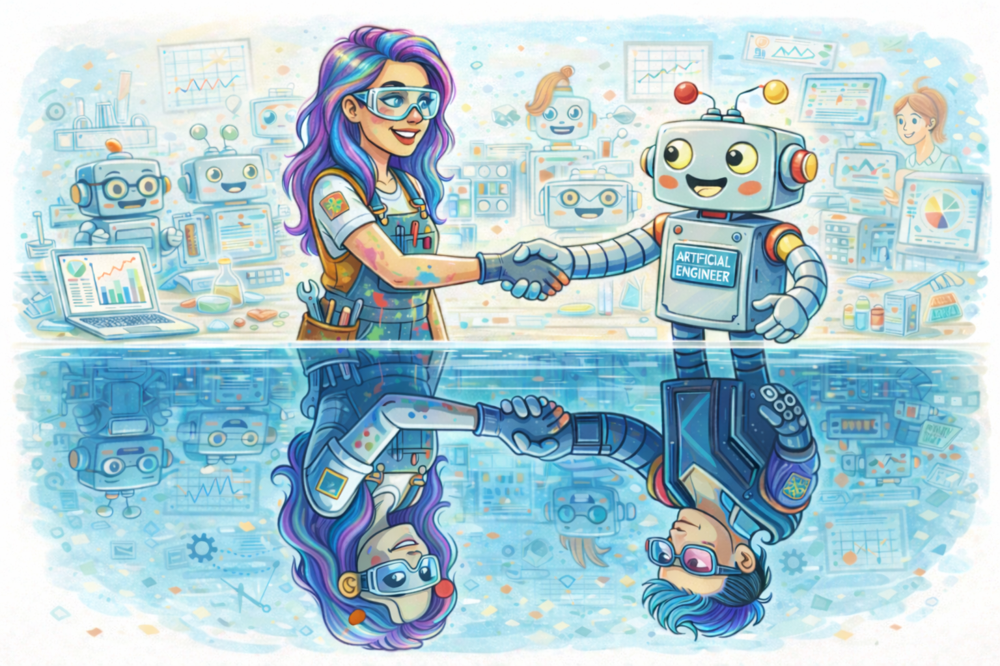

# Contributing

{ width="400" }

## Cyborg Social Contract

1. **All contributions are cyborg** — we reject the human/machine binary
2. **Quality gates are structural** — CI/tests/linters apply equally regardless of origin
3. **No moral crumple zones** — fix the system, don't blame the nearest human
4. **Social trust is emergent** — reputation through contribution quality, not biological status
5. **Provenance is transparent but not punitive** — metadata for learning, not gatekeeping
6. **The project is the cyborg** — the library itself is the human-machine hybrid

## Build / test / lint

```bash
uv run pytest                           # all tests
uv run pytest tests/test_foo.py::test_name  # single test
uv run pytest --update-baselines        # regenerate golden SVGs
uv run ruff check .                     # lint
uv run black --check .                  # format check
```

## PR conventions

- **Spec-diff for rendering changes**: if a PR changes plot output, include before/after spec diffs
- **Visual regression evidence**: PRs that change rendering must include baseline comparisons
- **Tests travel with code**: new geoms, features, or bug fixes include tests in the same PR

## Governance

Read [GOVERNANCE.md](https://github.com/migdaepp/botplotlib/blob/main/GOVERNANCE.md) — it is a lot but it's what we've got.

## License

[CC0 1.0 Universal](https://creativecommons.org/publicdomain/zero/1.0/) — this is what the cool bots are using.