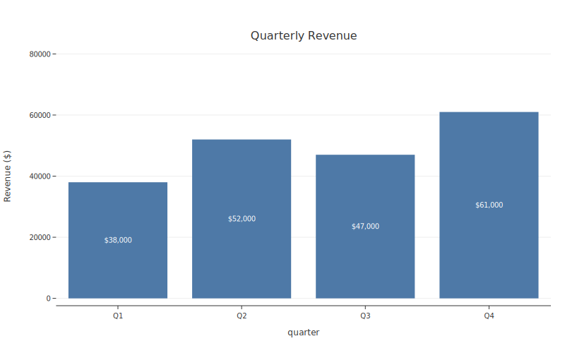
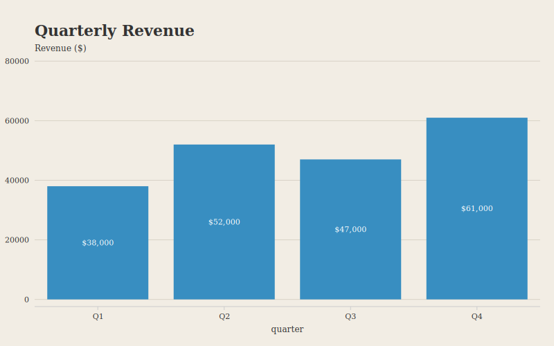

# Gallery

A visual tour of botplotlib's themes. Each theme is shown with the same multi-series dataset so you can compare typography, color, and layout choices side by side.

```python
import botplotlib as bpl

data = {
    "month": list(range(1, 13)) * 2,
    "revenue": [10, 13, 15, 14, 18, 22, 25, 28, 26, 30, 35, 40,
                20, 19, 21, 22, 23, 22, 24, 25, 26, 25, 27, 28],
    "segment": ["SaaS"] * 12 + ["Hardware"] * 12,
}
```

---

## Theme showcase

### Default

General-purpose theme for notebooks and screen presentations. Clean sans-serif type with a balanced color palette.

```python
fig = bpl.line(data, x="month", y="revenue", color="segment",
               title="Revenue by Segment", x_label="Month",
               y_label="Revenue ($M)")
fig.save_svg("gallery_default.svg")
```


### Bluesky

Optimized for social media sharing. Bold 24pt left-aligned titles, larger fonts, stronger contrast, and de-emphasized axes for mobile legibility.

```python
fig = bpl.line(data, x="month", y="revenue", color="segment",
               title="Revenue by Segment", x_label="Month",
               y_label="Revenue ($M)", theme="bluesky")
fig.save_svg("gallery_bluesky.svg")
```


### PDF

For digital academic papers (arxiv, SSRN). Serif fonts, muted palette, visible y-axis, and lighter line weights suited to PDF readers.

```python
fig = bpl.line(data, x="month", y="revenue", color="segment",
               title="Revenue by Segment", x_label="Month",
               y_label="Revenue ($M)", theme="pdf")
fig.save_svg("gallery_pdf.svg")
```


### Print

For black-and-white physical print. Grayscale palette and serif fonts ensure readability without color.

```python
fig = bpl.line(data, x="month", y="revenue", color="segment",
               title="Revenue by Segment", x_label="Month",
               y_label="Revenue ($M)", theme="print")
fig.save_svg("gallery_print.svg")
```


### Magazine

For editorial and data journalism. Warm parchment background, serif fonts, bold left-aligned titles, and a custom palette inspired by print magazines.

```python
fig = bpl.line(data, x="month", y="revenue", color="segment",
               title="Revenue by Segment", x_label="Month",
               y_label="Revenue ($M)", theme="magazine")
fig.save_svg("gallery_magazine.svg")
```


---

## Bar charts with labels

Use `labels=True` to add think-cell style value labels. Labels automatically appear inside bars when they fit, or above when they don't. Use `label_format` for custom formatting.

### Default

```python
bar_data = {
    "quarter": ["Q1", "Q2", "Q3", "Q4"],
    "revenue": [38000, 52000, 47000, 61000],
}

fig = bpl.bar(bar_data, x="quarter", y="revenue",
              title="Quarterly Revenue", y_label="Revenue ($)",
              labels=True, label_format="${:,.0f}")
fig.save_svg("gallery_bar_default.svg")
```



### Magazine

```python
fig = bpl.bar(bar_data, x="quarter", y="revenue",
              title="Quarterly Revenue", y_label="Revenue ($)",
              labels=True, label_format="${:,.0f}",
              theme="magazine")
fig.save_svg("gallery_bar_magazine.svg")
```



---

## Running examples locally

More examples are available in the [`examples/`](https://github.com/migdaepp/botplotlib/tree/main/examples) directory:

```bash
uv run python examples/demo.py
```

This generates SVG files for scatter, line, bar, theme showcase, and refactored plots.
