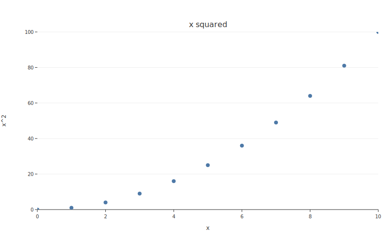

# Gallery

Visual examples showing botplotlib's output across plot types and themes. Each example includes the complete code to reproduce it.

---

## Scatter plots

### Basic scatter

```python
import botplotlib as bpl

fig = bpl.scatter(
    {"x": [1, 2, 3, 4, 5], "y": [2, 4, 3, 7, 5]},
    x="x", y="y",
    title="Basic Scatter",
)
fig.save_svg("basic_scatter.svg")
```


### Grouped scatter with legend

```python
import random
random.seed(42)
n = 80
weights = [2.0 + random.gauss(0, 0.6) for _ in range(n)]
mpg = [45 - 8 * w + random.gauss(0, 2.5) for w in weights]
origins = random.choices(["USA", "Europe", "Japan"], weights=[4, 3, 3], k=n)

fig = bpl.scatter(
    {"weight": weights, "mpg": mpg, "origin": origins},
    x="weight", y="mpg", color="origin",
    title="Fuel Efficiency by Vehicle Weight",
    x_label="Weight (1000 lbs)", y_label="Miles per Gallon",
)
fig.save_svg("grouped_scatter.svg")
```


---

## Line charts

### Multi-series line

```python
months = list(range(1, 13))
fig = bpl.line(
    {
        "month": months * 3,
        "revenue": (
            [10, 13, 15, 14, 18, 22, 25, 28, 26, 30, 35, 40]
            + [20, 19, 21, 22, 23, 22, 24, 25, 26, 25, 27, 28]
            + [5, 6, 7, 8, 8, 10, 11, 13, 14, 16, 18, 20]
        ),
        "segment": ["SaaS"] * 12 + ["Hardware"] * 12 + ["Services"] * 12,
    },
    x="month", y="revenue", color="segment",
    title="Monthly Revenue by Product Line",
    x_label="Month", y_label="Revenue ($K)",
)
fig.save_svg("multi_line.svg")
```


---

## Bar charts

### Simple bar

```python
fig = bpl.bar(
    {
        "language": ["Python", "JavaScript", "TypeScript", "Rust", "Go", "Java"],
        "score": [92, 78, 71, 54, 48, 45],
    },
    x="language", y="score",
    title="Programming Language Popularity",
    x_label="Language", y_label="Popularity Score",
)
fig.save_svg("bar.svg")
```


---

## Waterfall charts

### Income statement waterfall

```python
fig = bpl.waterfall(
    {
        "category": ["Revenue", "COGS", "Gross Profit", "OpEx", "Tax", "Net Income"],
        "amount": [500, -200, 300, -150, -45, 105],
    },
    x="category", y="amount",
    title="Income Statement Waterfall",
    y_label="Amount ($K)",
)
fig.save_svg("waterfall.svg")
```


---

## Layered plots

### Line + scatter overlay

```python
fig = (
    bpl.plot({
        "year": [2019, 2020, 2021, 2022, 2023, 2024],
        "actual": [4.2, 3.8, 5.1, 6.3, 7.0, 8.2],
        "forecast": [4.0, 4.5, 5.0, 5.5, 6.0, 6.5],
    })
    .add_line(x="year", y="forecast")
    .add_scatter(x="year", y="actual")
)
fig.title = "Actual vs Forecast Revenue ($B)"
fig.save_svg("layered.svg")
```


---

## Theme showcase

The same data rendered with each of the five built-in themes:

### Default

```python
import math
xs = [i * 0.1 for i in range(63)]
data = {
    "x": xs * 2,
    "y": [math.sin(v) for v in xs] + [math.cos(v) for v in xs],
    "fn": ["sin(x)"] * 63 + ["cos(x)"] * 63,
}

fig = bpl.line(data, x="x", y="y", color="fn", title="Default Theme")
fig.save_svg("theme_default.svg")
```


### Bluesky

```python
fig = bpl.line(data, x="x", y="y", color="fn",
               title="Bluesky Theme", theme="bluesky")
fig.save_svg("theme_bluesky.svg")
```


### Substack

```python
fig = bpl.line(data, x="x", y="y", color="fn",
               title="Substack Theme", theme="substack")
fig.save_svg("theme_substack.svg")
```


### PDF (arxiv / SSRN)

```python
fig = bpl.line(data, x="x", y="y", color="fn",
               title="PDF Theme", theme="pdf")
fig.save_svg("theme_pdf.svg")
```


### Print (B&W)

```python
fig = bpl.line(data, x="x", y="y", color="fn",
               title="Print Theme", theme="print")
fig.save_svg("theme_print.svg")
```


---

## Matplotlib refactored

Before (matplotlib, 11 lines):

```python
import matplotlib.pyplot as plt

x = [0, 1, 2, 3, 4, 5, 6, 7, 8, 9, 10]
y = [0, 1, 4, 9, 16, 25, 36, 49, 64, 81, 100]

plt.figure(figsize=(8, 5))
plt.scatter(x, y)
plt.title("x squared")
plt.xlabel("x")
plt.ylabel("x^2")
plt.savefig("old_plot.png")
```

After (botplotlib, 1 call + auto-converted):

```python
from botplotlib.refactor import from_matplotlib
import botplotlib as bpl

spec = from_matplotlib(mpl_code)
fig = bpl.render(spec)
fig.save_svg("refactored.svg")
```



---

## Running examples locally

More examples are available in the [`examples/`](https://github.com/migdaepp/botplotlib/tree/main/examples) directory:

```bash
uv run python examples/demo.py
```

This generates SVG files for scatter, line, bar, theme showcase, and refactored plots.
