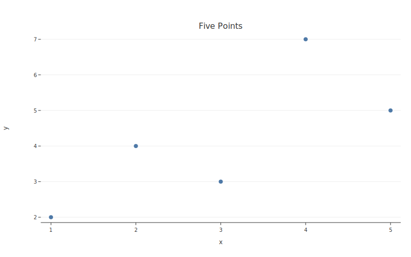
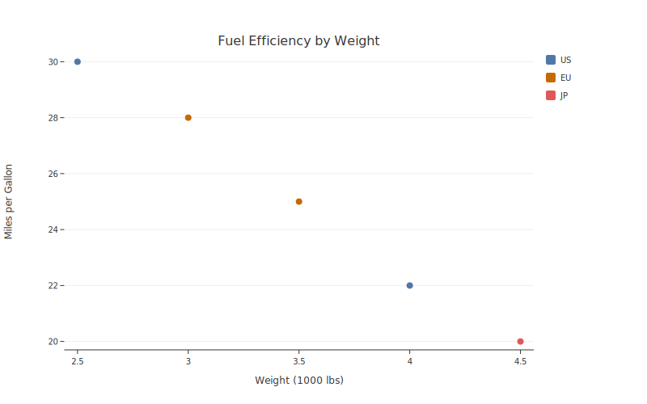

# Getting Started

## Installation

```bash
pip install botplotlib
```

For PNG export support (requires Cairo):

```bash
pip install botplotlib[png]
```

## Your first plot

```python
import botplotlib as bpl

fig = bpl.scatter(
    {"x": [1, 2, 3, 4, 5], "y": [2, 4, 3, 7, 5]},
    x="x",
    y="y",
    title="Five Points",
)
fig.save_svg("my_plot.svg")
```



That's it. One function call produces a complete, styled, WCAG-compliant scatter plot.

## Adding color groups

Pass a `color` column to split data into groups with automatic legend:

```python
data = {
    "weight": [2.5, 3.0, 3.5, 4.0, 4.5],
    "mpg": [30, 28, 25, 22, 20],
    "origin": ["US", "EU", "EU", "US", "JP"],
}
fig = bpl.scatter(
    data, x="weight", y="mpg", color="origin",
    title="Fuel Efficiency by Weight",
    x_label="Weight (1000 lbs)",
    y_label="Miles per Gallon",
)
fig.save_svg("grouped.svg")
```



## Saving output

### SVG (default)

```python
fig.save_svg("plot.svg")
```

### PNG (requires `botplotlib[png]`)

```python
fig.save_png("plot.png")
```

### Get SVG as a string

```python
svg_string = fig.to_svg()
```

### Jupyter / marimo notebooks

Figures render inline automatically — just return the figure object from a cell.

## Using themes

Every theme produces publication-ready output. Pass the `theme` parameter:

```python
fig = bpl.scatter(data, x="x", y="y", theme="bluesky")
```

Available themes: `default`, `bluesky`, `substack`, `pdf`, `print`, `magazine`. See the [Themes guide](guide/themes.md) for details and visual examples.

## Next steps

- [**Plot Types**](guide/plot-types.md) — scatter, line, bar, and waterfall
- [**Data Formats**](guide/data-formats.md) — dicts, DataFrames, Arrow, and more
- [**JSON Path**](guide/json-path.md) — using botplotlib from LLM tool calls
- [**Gallery**](gallery/index.md) — visual examples with code
