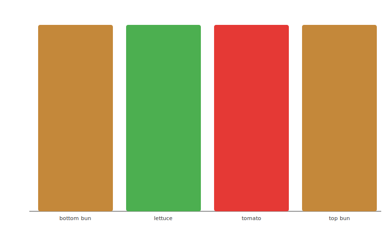
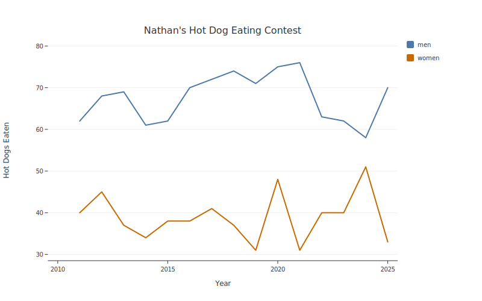
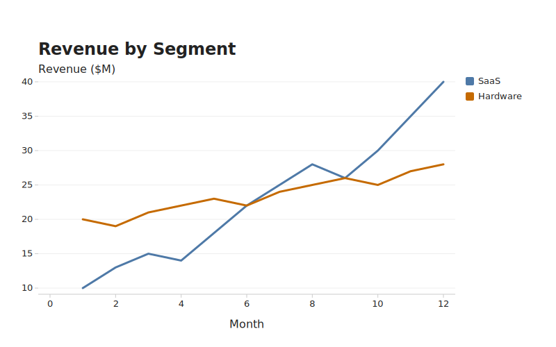
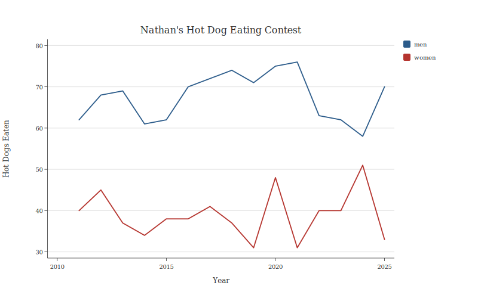
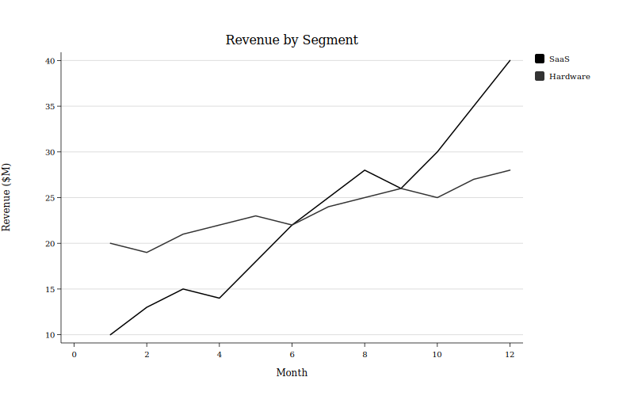
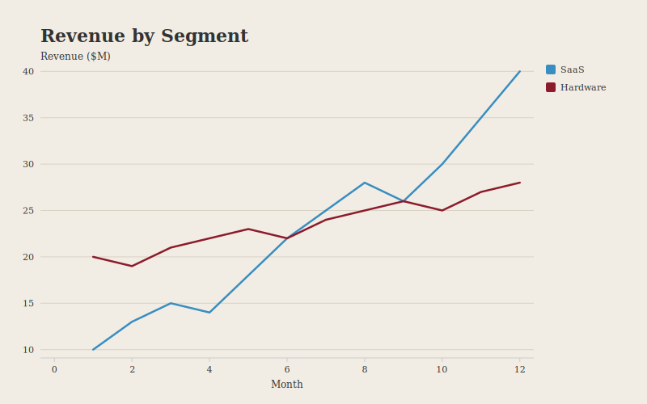

# Guide

## Quick example

```python
import botplotlib as blt

data = {
    "layer": ["bottom bun", "lettuce", "bot", "tomato", "top bun"],
    "size": [1, 1, 1, 1, 1],
}
fig = blt.bar(
    data, x="layer", y="size", color="layer",
    color_map={"bottom bun": "#B07830", "lettuce": "#388E3C",
               "bot": "#4E79A7", "tomato": "#E53935",
               "top bun": "#B07830"},
)
fig.save_svg("plot.svg")
```

  

## Themes

| Theme | Alias | Personality |
|-------|-------|-------------|
| `default` | — | general purpose, colorful, fine, whatever |
| `bluesky` | `social` | scroll-stopping titles, fat dots for mobile thumbs |
| `pdf` | `arxiv` | academic and restrained, everyone will think u r v smart |
| `print` | — | sometimes you weirdly still need grayscale |
| `magazine` | `economist` | we all know which magazine it is we're just not gonna say it |

All theme palettes enforce WCAG AA contrast ratios (>= 3:1 against white). This is a compiler error, not a warning. You literally cannot ship inaccessible colors because [accountability lives in systems](https://estsjournal.org/index.php/ests/article/view/260).   

```python
import botplotlib as blt

years = list(range(2011, 2026))
data = {
    "year": years * 2,
    "hot_dogs": [62, 68, 69, 61, 62, 70, 72, 74, 71, 75, 76, 63, 62, 58, 70,
                 40, 45, 37, 34, 38, 38, 41, 37, 31, 48, 31, 40, 40, 51, 33],
    "division": ["men"] * 15 + ["women"] * 15,
}
```

These Data are from [Nathan's Famous Hot Dog Eating Contest](https://en.wikipedia.org/wiki/Nathan%27s_Hot_Dog_Eating_Contest), Coney Island, every July 4th since 1916.

### Default

```python
fig = blt.line(data, x="year", y="hot_dogs", color="division",
               title="Nathan's Hot Dog Eating Contest",
               x_label="Year", y_label="Hot Dogs Eaten")
```



### Bluesky

```python
fig = blt.line(data, x="year", y="hot_dogs", color="division",
               title="Nathan's Hot Dog Eating Contest",
               x_label="Year", y_label="Hot Dogs Eaten",
               theme="bluesky")
```



### PDF

```python
fig = blt.line(data, x="year", y="hot_dogs", color="division",
               title="Nathan's Hot Dog Eating Contest",
               x_label="Year", y_label="Hot Dogs Eaten",
               theme="pdf")
```



### Print

```python
fig = blt.line(data, x="year", y="hot_dogs", color="division",
               title="Nathan's Hot Dog Eating Contest",
               x_label="Year", y_label="Hot Dogs Eaten",
               theme="print")
```



### Magazine

```python
fig = blt.line(data, x="year", y="hot_dogs", color="division",
               title="Nathan's Hot Dog Eating Contest",
               x_label="Year", y_label="Hot Dogs Eaten",
               theme="magazine")
```



Aliases work too — `social` and `arxiv` map to their obvious counterparts. See the [API Reference](api/index.md) for the full `ThemeSpec` schema.

## Data formats

Pass whatever your pipeline produces and botplotlib figures it out. We're all mad here.

Supported formats:

1. **Dict of columns** — `{"x": [1, 2, 3], "y": [4, 5, 6]}` (recommended)
2. **List of dicts** — `[{"x": 1, "y": 4}, {"x": 2, "y": 5}]`
3. **Polars DataFrame**
4. **Pandas DataFrame**
5. **Arrow Table / RecordBatch**
6. **Generator / iterator** — materialized to list of dicts automatically

If a column doesn't exist, the compiler raises a clear `ValueError` naming the missing column.

---

## JSON path

Agents can generate plots by producing a `PlotSpec` as JSON — no Python code execution required. Same structural gates (WCAG contrast, validation) apply regardless of who built the spec.

### PlotSpec JSON schema

```json
{
    "data": {
        "columns": {
            "column_name": [values...]
        }
    },
    "layers": [
        {
            "geom": "scatter | line | bar | waterfall",
            "x": "column_name",
            "y": "column_name",
            "color": "column_name (optional)",
            "labels": "boolean, default false (optional)",
            "label_format": "string (optional)"
        }
    ],
    "labels": {
        "title": "string (optional)",
        "subtitle": "string (optional)",
        "x": "string (optional)",
        "y": "string (optional)",
        "footnote": "string (optional)"
    },
    "legend": {
        "show": true,
        "position": "top | bottom | left | right"
    },
    "size": {
        "width": 800,
        "height": 500
    },
    "theme": "default | bluesky | pdf | print | magazine"
}
```

---

## Refactoring from matplotlib

Feed it your matplotlib scripts. The translation is often shorter than the import block it replaces.

```python
from botplotlib.refactor import to_botplotlib_code

bpl_code = to_botplotlib_code("""
import matplotlib.pyplot as plt
import numpy as np

x = [0, 1, 2, 3, 4, 5]
y = [0, 1, 4, 9, 16, 25]

plt.figure(figsize=(8, 5))
plt.scatter(x, y)
plt.title("x squared")
plt.xlabel("x")
plt.ylabel("x^2")
plt.savefig("old_plot.png")
""")

print(bpl_code)
```

Output:

```python
import botplotlib as blt

fig = blt.scatter(
    {"x": [0, 1, 2, 3, 4, 5], "y": [0, 1, 4, 9, 16, 25]},
    x="x",
    y="y",
    title="x squared",
    x_label="x",
    y_label="x^2",
)
fig.save_svg("plot.svg")
```

You can also extract a `PlotSpec` directly:

```python
from botplotlib.refactor import from_matplotlib
import botplotlib as blt

spec = from_matplotlib("my_old_script.py")
fig = blt.render(spec)
fig.save_svg("migrated.svg")
```
