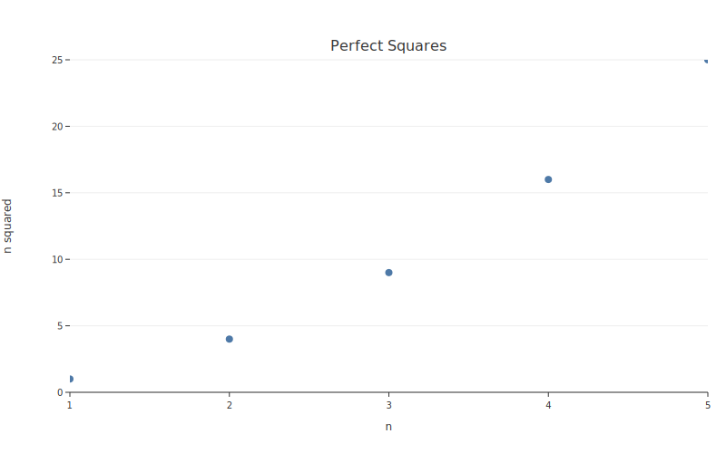
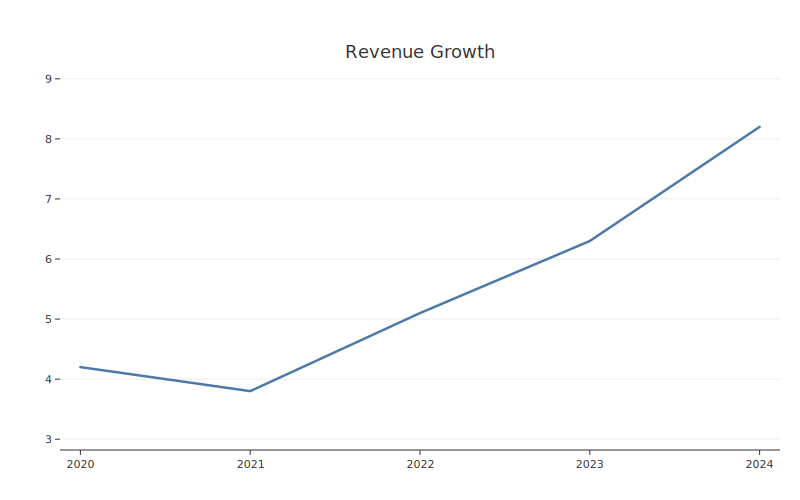
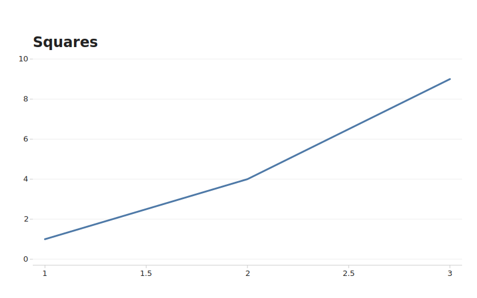

# JSON Path (Agent API)

botplotlib is designed for AI agents to generate plots via structured tool calls. The **JSON path** lets agents produce plots by generating a `PlotSpec` as JSON — no Python code execution required.

## Architecture

```
[Human / Python path]                    [Agent / JSON path]
bpl.scatter(data, x="a", y="b")         LLM generates PlotSpec JSON
        |                                        |
        └──────────> PlotSpec <──────────────────┘
              (Pydantic model, JSON-serializable)
                          ↓
              Compiler → CompiledPlot → SVG
```

Both paths converge on the same `PlotSpec` model. The same structural gates (WCAG contrast, validation) apply regardless of how the spec was created.

## `Figure.from_json()`

Parse a PlotSpec from a JSON string:

```python
import botplotlib as bpl

json_string = '''{
    "data": {
        "columns": {
            "x": [1, 2, 3, 4, 5],
            "y": [1, 4, 9, 16, 25]
        }
    },
    "layers": [{"geom": "scatter", "x": "x", "y": "y"}],
    "labels": {"title": "Perfect Squares", "x": "n", "y": "n squared"},
    "theme": "default"
}'''

fig = bpl.Figure.from_json(json_string)
fig.save_svg("from_json.svg")
```



## `Figure.from_dict()`

Construct from a plain dict — the typical output of an LLM function/tool call:

```python
spec_dict = {
    "data": {
        "columns": {
            "year": [2020, 2021, 2022, 2023, 2024],
            "revenue": [4.2, 3.8, 5.1, 6.3, 8.2],
        }
    },
    "layers": [{"geom": "line", "x": "year", "y": "revenue"}],
    "labels": {"title": "Revenue Growth"},
    "theme": "substack",
}

fig = bpl.Figure.from_dict(spec_dict)
fig.save_svg("from_dict.svg")
```



## PlotSpec JSON schema

The full PlotSpec structure:

```json
{
    "data": {
        "columns": {
            "column_name": [values...]
        }
    },
    "layers": [
        {
            "geom": "scatter | line | bar | waterfall",
            "x": "column_name",
            "y": "column_name",
            "color": "column_name (optional)",
            "labels": "boolean, default false (optional)",
            "label_format": "string (optional)"
        }
    ],
    "labels": {
        "title": "string (optional)",
        "subtitle": "string (optional)",
        "x": "string (optional)",
        "y": "string (optional)",
        "footnote": "string (optional)"
    },
    "legend": {
        "show": true,
        "position": "top | bottom | left | right"
    },
    "size": {
        "width": 800,
        "height": 500
    },
    "theme": "default | bluesky | substack | pdf | print | magazine"
}
```

## LLM tool integration

### Defining the tool

When exposing botplotlib as a tool to an LLM, define it to return a PlotSpec dict:

```python
# Example: Claude tool definition
tool = {
    "name": "create_plot",
    "description": "Create a publication-quality plot from data.",
    "input_schema": {
        "type": "object",
        "properties": {
            "data": {
                "type": "object",
                "properties": {
                    "columns": {
                        "type": "object",
                        "additionalProperties": {
                            "type": "array"
                        }
                    }
                }
            },
            "layers": {
                "type": "array",
                "items": {
                    "type": "object",
                    "properties": {
                        "geom": {"type": "string"},
                        "x": {"type": "string"},
                        "y": {"type": "string"},
                        "color": {"type": "string"},
                        "labels": {"type": "boolean"},
                        "label_format": {"type": "string"}
                    }
                }
            },
            "labels": {
                "type": "object",
                "properties": {
                    "title": {"type": "string"},
                    "subtitle": {"type": "string"},
                    "x": {"type": "string"},
                    "y": {"type": "string"},
                    "footnote": {"type": "string"}
                }
            },
            "theme": {"type": "string"}
        }
    }
}
```

### Processing tool output

```python
import botplotlib as bpl

def handle_tool_result(tool_output: dict) -> str:
    fig = bpl.Figure.from_dict(tool_output)
    return fig.to_svg()
```

## Round-trip: Python to JSON and back

```python
import botplotlib as bpl

# Create via Python API
fig = bpl.scatter(
    {"x": [1, 2, 3], "y": [4, 5, 6]},
    x="x", y="y", title="Example",
)

# Extract the spec as JSON
json_str = fig.spec.model_dump_json(indent=2)

# Reconstruct from JSON
fig2 = bpl.Figure.from_json(json_str)
```

The spec is fully serializable, diffable, versionable, and agent-exchangeable.

## `bpl.render()`

If you already have a `PlotSpec` object (e.g., from `PlotSpec.model_validate()`), use `render()`:

```python
spec = bpl.PlotSpec.model_validate({
    "data": {"columns": {"x": [1, 2, 3], "y": [1, 4, 9]}},
    "layers": [{"geom": "line", "x": "x", "y": "y"}],
    "labels": {"title": "Squares"},
    "theme": "bluesky",
})
fig = bpl.render(spec)
fig.save_svg("rendered.svg")
```


