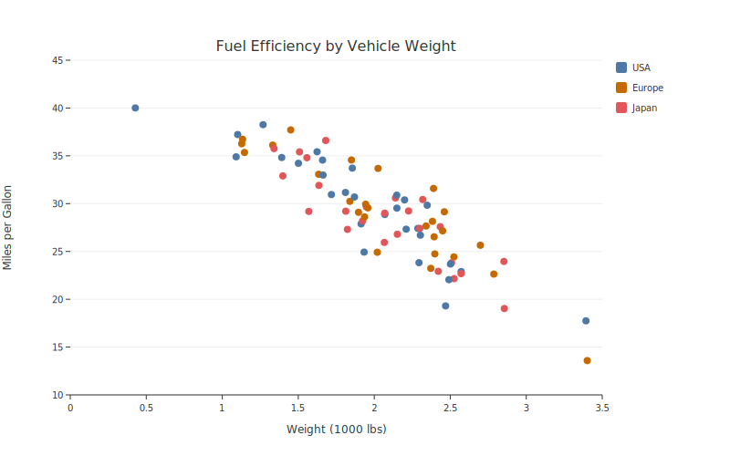
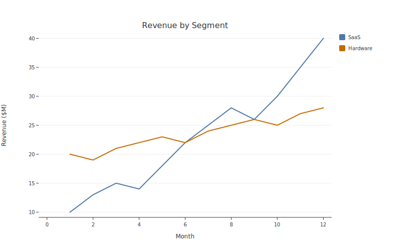
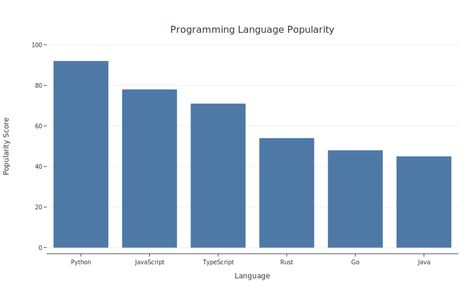
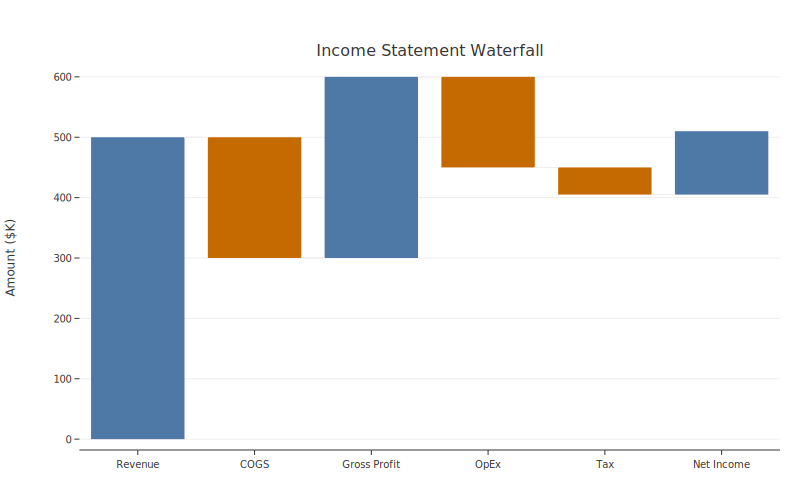
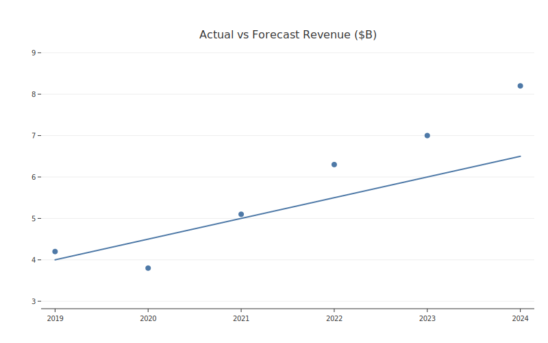

# Plot Types

botplotlib ships with four built-in plot types. Each is a single function call that returns a `Figure` object.

## Scatter

Best for showing relationships between two numeric variables. Optionally group by a categorical column.

```python
import botplotlib as bpl

fig = bpl.scatter(
    {
        "weight": [2.5, 3.0, 3.5, 4.0, 4.5, 3.2, 2.8],
        "mpg": [30, 28, 25, 22, 20, 26, 29],
        "origin": ["US", "EU", "EU", "US", "JP", "JP", "EU"],
    },
    x="weight",
    y="mpg",
    color="origin",
    title="Fuel Efficiency by Vehicle Weight",
    x_label="Weight (1000 lbs)",
    y_label="Miles per Gallon",
)
fig.save_svg("scatter.svg")
```



### Parameters

| Parameter | Type | Default | Description |
|-----------|------|---------|-------------|
| `data` | any | *required* | Data in any [supported format](data-formats.md) |
| `x` | `str` | *required* | Column name for x-axis |
| `y` | `str` | *required* | Column name for y-axis |
| `color` | `str` | `None` | Column name for color grouping |
| `title` | `str` | `None` | Plot title |
| `x_label` | `str` | `None` | X-axis label |
| `y_label` | `str` | `None` | Y-axis label |
| `theme` | `str` | `"default"` | [Theme](themes.md) name |
| `width` | `float` | `800` | Canvas width in pixels |
| `height` | `float` | `500` | Canvas height in pixels |

---

## Line

Best for trends and time series. Multiple series are created automatically when `color` is specified.

```python
months = list(range(1, 13))
fig = bpl.line(
    {
        "month": months * 2,
        "revenue": [10, 13, 15, 14, 18, 22, 25, 28, 26, 30, 35, 40,
                    20, 19, 21, 22, 23, 22, 24, 25, 26, 25, 27, 28],
        "segment": ["SaaS"] * 12 + ["Hardware"] * 12,
    },
    x="month",
    y="revenue",
    color="segment",
    title="Revenue by Segment",
    x_label="Month",
    y_label="Revenue ($M)",
)
fig.save_svg("line.svg")
```



### Parameters

Same signature as `scatter()`. See the [scatter parameters table](#parameters) above.

---

## Bar

Best for comparing values across categories.

```python
fig = bpl.bar(
    {
        "language": ["Python", "JavaScript", "TypeScript", "Rust", "Go", "Java"],
        "score": [92, 78, 71, 54, 48, 45],
    },
    x="language",
    y="score",
    title="Programming Language Popularity",
    x_label="Language",
    y_label="Popularity Score",
)
fig.save_svg("bar.svg")
```



### Parameters

Same signature as `scatter()`. See the [scatter parameters table](#parameters) above.

---

## Waterfall

Shows how an initial value is increased or decreased by a series of intermediate values, reaching a final total. Positive changes are colored differently from negative changes.

```python
fig = bpl.waterfall(
    {
        "category": ["Revenue", "COGS", "Gross Profit", "OpEx",
                      "Tax", "Net Income"],
        "amount": [500, -200, 300, -150, -45, 105],
    },
    x="category",
    y="amount",
    title="Income Statement Waterfall",
    x_label="",
    y_label="Amount ($K)",
)
fig.save_svg("waterfall.svg")
```



### Parameters

| Parameter | Type | Default | Description |
|-----------|------|---------|-------------|
| `data` | any | *required* | Data in any [supported format](data-formats.md) |
| `x` | `str` | *required* | Column name for categories |
| `y` | `str` | *required* | Column name for values |
| `title` | `str` | `None` | Plot title |
| `x_label` | `str` | `None` | X-axis label |
| `y_label` | `str` | `None` | Y-axis label |
| `theme` | `str` | `"default"` | [Theme](themes.md) name |
| `width` | `float` | `800` | Canvas width in pixels |
| `height` | `float` | `500` | Canvas height in pixels |

!!! note
    Waterfall does not support the `color` parameter — colors are determined automatically based on positive/negative values.

---

## Layered plots

For multi-layer plots (e.g., line + scatter overlay), use `bpl.plot()` with chained `.add_*()` methods:

```python
fig = (
    bpl.plot(
        {
            "year": [2019, 2020, 2021, 2022, 2023, 2024],
            "actual": [4.2, 3.8, 5.1, 6.3, 7.0, 8.2],
            "forecast": [4.0, 4.5, 5.0, 5.5, 6.0, 6.5],
        }
    )
    .add_line(x="year", y="forecast")
    .add_scatter(x="year", y="actual")
)
fig.title = "Actual vs Forecast Revenue ($B)"
fig.save_svg("layered.svg")
```



Available layer methods: `.add_scatter()`, `.add_line()`, `.add_bar()`. Each accepts `x`, `y`, and optional `color` parameters.
