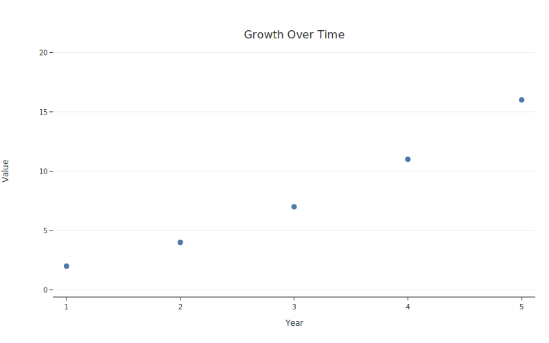

# Refactoring from Matplotlib

botplotlib includes an AST-based refactor module that converts existing matplotlib scripts into clean PlotSpecs — no matplotlib installation required.

## `from_matplotlib()`

Parse a matplotlib script and extract an equivalent `PlotSpec`:

```python
from botplotlib.refactor import from_matplotlib
import botplotlib as bpl

spec = from_matplotlib("my_old_script.py")
fig = bpl.render(spec)
fig.save_svg("migrated.svg")
```

### From a file path

```python
spec = from_matplotlib("path/to/script.py")
```

### From a string

```python
mpl_code = """
import matplotlib.pyplot as plt

x = [1, 2, 3, 4, 5]
y = [2, 4, 7, 11, 16]

plt.scatter(x, y)
plt.title("Growth Over Time")
plt.xlabel("Year")
plt.ylabel("Value")
plt.show()
"""

spec = from_matplotlib(mpl_code)
fig = bpl.render(spec)
fig.save_svg("converted.svg")
```



## `to_botplotlib_code()`

Generate the equivalent botplotlib Python code — useful for seeing the token efficiency difference:

```python
from botplotlib.refactor import to_botplotlib_code

bpl_code = to_botplotlib_code("""
import matplotlib.pyplot as plt
import numpy as np

x = [0, 1, 2, 3, 4, 5]
y = [0, 1, 4, 9, 16, 25]

plt.figure(figsize=(8, 5))
plt.scatter(x, y)
plt.title("x squared")
plt.xlabel("x")
plt.ylabel("x^2")
plt.savefig("old_plot.png")
""")

print(bpl_code)
```

Output:

```python
import botplotlib as bpl

fig = bpl.scatter(
    {"x": [0, 1, 2, 3, 4, 5], "y": [0, 1, 4, 9, 16, 25]},
    x="x",
    y="y",
    title="x squared",
    x_label="x",
    y_label="x^2",
)
fig.save_svg("plot.svg")
```

9 lines of matplotlib become 1 function call.

## Supported matplotlib patterns

The refactor module handles these `matplotlib.pyplot` and `Axes` patterns:

| Pattern | Extracted to |
|---------|-------------|
| `plt.scatter(x, y)` | `scatter` layer |
| `plt.plot(x, y)` | `line` layer |
| `plt.bar(x, y)` | `bar` layer |
| `plt.barh(x, y)` | `bar` layer |
| `ax.scatter(x, y)` | `scatter` layer |
| `ax.plot(x, y)` | `line` layer |
| `ax.bar(x, y)` | `bar` layer |
| `plt.title("...")` | `labels.title` |
| `plt.xlabel("...")` | `labels.x` |
| `plt.ylabel("...")` | `labels.y` |
| `plt.figure(figsize=(w, h))` | `size.width`, `size.height` |
| `plt.legend()` | `legend.show = True` |
| Format strings (`'ro--'`, `'b.'`) | Color and geom type |

## Before / after examples

The `examples/refactor_examples/` directory contains paired before/after scripts:

| Before (matplotlib) | After (botplotlib) |
|---------------------|-------------------|
| `01_scatter_before.py` | `01_scatter_after.py` |
| `02_line_before.py` | `02_line_after.py` |
| `03_bar_before.py` | `03_bar_after.py` |
| `04_publication_before.py` | `04_publication_after.py` |

Run `05_auto_refactor_demo.py` to see the automated conversion in action.

## How it works

The refactor module works by:

1. **AST parsing** — parses the matplotlib script into a Python AST (no execution)
2. **Pattern matching** — identifies `plt.*` and `ax.*` calls, variable assignments, and data definitions
3. **Data extraction** — resolves variable references to extract actual data values
4. **Spec construction** — builds a `PlotSpec` from the extracted information
5. **Code generation** — `to_botplotlib_code()` renders the spec as clean Python

Because it uses AST analysis rather than execution, it never imports or runs the matplotlib code. This means matplotlib doesn't need to be installed.
