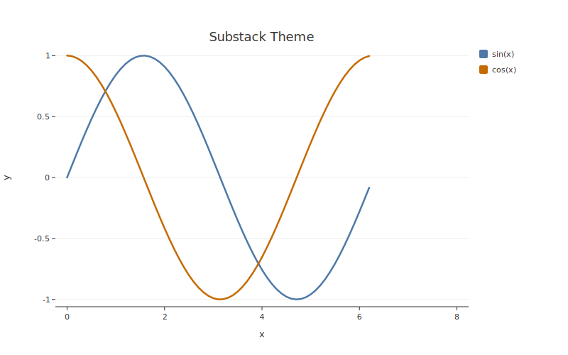

# Themes

Every botplotlib theme produces publication-ready output with zero configuration. All palettes enforce WCAG AA contrast ratios (>= 3:1 against white) — this is a compiler-level gate, not a warning.

## Available themes

| Theme | Alias | Use case | Font style |
|-------|-------|----------|------------|
| `default` | — | Screen, notebooks, general purpose | Sans-serif, colorful palette |
| `bluesky` | `social` | Social media posts | Larger type, bolder strokes |
| `substack` | — | Email newsletters, web articles | Refined, slightly larger text |
| `pdf` | `arxiv` | Digital academic papers (arxiv, SSRN) | Serif, muted colors |
| `print` | — | Physical print, B&W journals | Grayscale, serif fonts |
| `magazine` | `economist` | Magazine, editorial layouts | Serif, left-aligned titles, warm background |

## Usage

Pass the theme name to any plot function:

```python
import botplotlib as bpl

data = {"x": [1, 2, 3, 4, 5], "y": [2, 4, 3, 7, 5]}

fig = bpl.scatter(data, x="x", y="y", theme="bluesky")
fig.save_svg("bluesky_plot.svg")
```

Theme aliases work too:

```python
fig = bpl.scatter(data, x="x", y="y", theme="social")     # same as "bluesky"
fig = bpl.scatter(data, x="x", y="y", theme="arxiv")      # same as "pdf"
fig = bpl.scatter(data, x="x", y="y", theme="economist")  # same as "magazine"
```

## Theme details

### `default`

The general-purpose theme for screen display and notebooks. Clean sans-serif typography with a vibrant, colorblind-aware 10-color palette.

```python
fig = bpl.line(data, x="x", y="y", title="Default Theme")
```


### `bluesky`

Optimized for social media sharing. Larger text and bolder strokes ensure readability at smaller display sizes and on mobile feeds.

```python
fig = bpl.line(data, x="x", y="y", title="Bluesky Theme", theme="bluesky")
```


### `substack`

Designed for embedding in newsletters and web articles. Refined spacing and slightly larger text for comfortable reading in long-form content.

```python
fig = bpl.line(data, x="x", y="y", title="Substack Theme", theme="substack")
```



### `pdf`

Academic-oriented theme for digital papers (arxiv, SSRN). Serif fonts and muted colors that work well in PDF documents.

```python
fig = bpl.line(data, x="x", y="y", title="PDF Theme", theme="pdf")
```


### `print`

Grayscale theme for physical print and B&W journals. Serif fonts and a grayscale palette ensure legibility without color.

```python
fig = bpl.line(data, x="x", y="y", title="Print Theme", theme="print")
```


### `magazine`

Editorial-style theme inspired by data journalism. Left-aligned bold titles, warm parchment background, serif fonts, and a subdued palette designed for magazine and newsletter layouts.

```python
fig = bpl.line(data, x="x", y="y", title="Magazine Theme", theme="magazine")
```


## Platform stance

These starting integrations are chosen to seed the project around open platforms and open science: Bluesky, Substack, and academic publishing. X/Twitter is not included — we invest in platforms aligned with open access and open discourse.

botplotlib is open-source, so contributors are welcome to add themes for other platforms.

## ThemeSpec model

Under the hood, each theme is a `ThemeSpec` Pydantic model. Key properties:

| Property | Description |
|----------|-------------|
| `background_color` | Background fill color |
| `font_family` | CSS font stack |
| `title_font_size` | Title text size (px) |
| `label_font_size` | Axis label text size (px) |
| `tick_font_size` | Tick label text size (px) |
| `text_color` | Text color |
| `axis_color` | Axis line color |
| `grid_color` | Grid line color |
| `show_x_grid` / `show_y_grid` | Grid visibility |
| `point_radius` | Scatter point radius (px) |
| `line_width` | Line stroke width (px) |
| `bar_padding` | Bar padding as fraction of band width |
| `title_font_weight` | Title font weight (`normal` or `bold`) |
| `title_align` | Title alignment (`left`, `center`, `right`) |
| `subtitle_font_size` | Subtitle text size (px) |
| `subtitle_color` | Subtitle color (`None` → text_color) |
| `footnote_font_size` | Footnote text size (px) |
| `footnote_color` | Footnote color (`None` → text_color) |
| `y_label_position` | Y-axis label position (`side` or `top`) |
| `palette` | List of hex colors (WCAG AA compliant) |
| `margin_*` | Plot margins (top, right, bottom, left) |

See the [API Reference](../api/index.md) for the full `ThemeSpec` schema.
