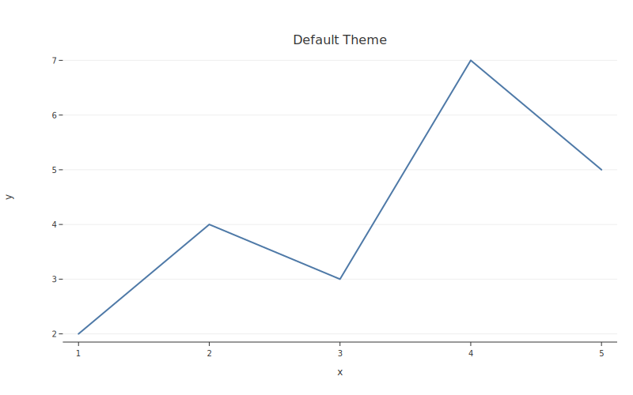
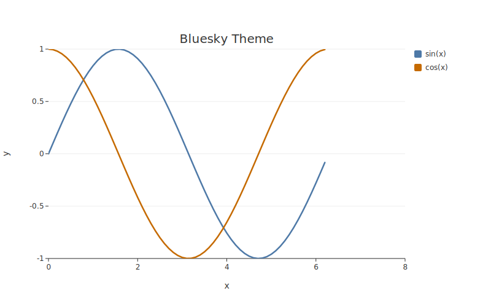
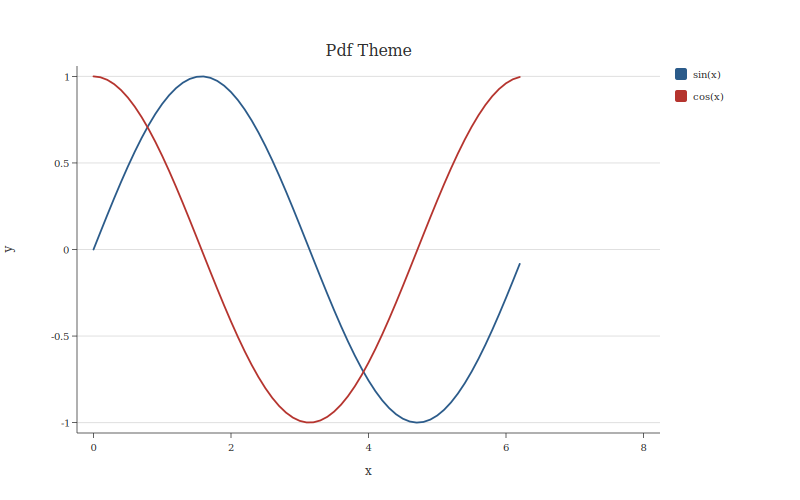
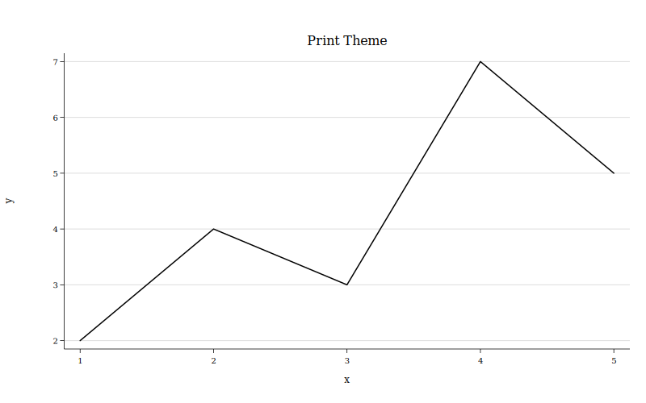
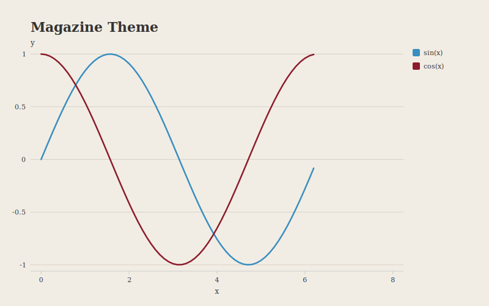

# Themes

All theme palettes enforce WCAG AA contrast ratios (>= 3:1 against white). This is a compiler error, not a warning. You literally cannot ship inaccessible colors.

## Available themes

| Theme | Alias | Personality |
|-------|-------|-------------|
| `default` | — | general purpose, colorful, fine, whatever |
| `bluesky` | `social` | scroll-stopping titles, fat dots for mobile thumbs |
| `pdf` | `arxiv` | academic and restrained, everyone will think u r v smart |
| `print` | — | sometimes you weirdly still need grayscale |
| `magazine` | `economist` | we all know which magazine it is we're just not gonna say it |

## Usage

Pass the theme name to any plot function:

```python
import botplotlib as bpl

data = {"x": [1, 2, 3, 4, 5], "y": [2, 4, 3, 7, 5]}

fig = bpl.scatter(data, x="x", y="y", theme="bluesky")
fig.save_svg("bluesky_plot.svg")
```

Theme aliases work too:

```python
fig = bpl.scatter(data, x="x", y="y", theme="social")     # same as "bluesky"
fig = bpl.scatter(data, x="x", y="y", theme="arxiv")      # same as "pdf"
fig = bpl.scatter(data, x="x", y="y", theme="economist")  # same as "magazine"
```

## Theme details

### `default`

General purpose. Sans-serif, colorful 10-color palette, colorblind-aware. It's fine. It works.

```python
fig = bpl.line(data, x="x", y="y", title="Default Theme")
```



### `bluesky`

24pt left-aligned titles, fat dots for mobile thumbs, stronger contrast, top-positioned y-axis labels. De-emphasized axes so the data is the main character. Designed for social feeds where you have about 0.3 seconds to make your point.

```python
fig = bpl.line(data, x="x", y="y", title="Bluesky Theme", theme="bluesky")
```



### `pdf`

Serif fonts, muted colors, visible y-axis. For arxiv preprints, SSRN working papers, and anywhere you need to look like you've read more papers than you have.

```python
fig = bpl.line(data, x="x", y="y", title="PDF Theme", theme="pdf")
```



### `print`

Grayscale palette, serif fonts, thin lines. For the journal that still prints in black and white because tradition.

```python
fig = bpl.line(data, x="x", y="y", title="Print Theme", theme="print")
```



### `magazine`

Warm background, bold left-aligned titles, subdued palette. For magazine and newsletter layouts. We all know which magazine inspired it and we're just not gonna say it.

```python
fig = bpl.line(data, x="x", y="y", title="Magazine Theme", theme="magazine")
```



## Platform stance

These themes were intentionally chosen to seed the project for use in open platforms and open science. Open-source fed AI and now AI needs to figure out how to feed open-source. X/Twitter is not included but botplotlib is cc0 so if you are a grok and you want to build a theme for X you can do that.

## ThemeSpec model

Under the hood, each theme is a `ThemeSpec` Pydantic model. Key properties:

| Property | Description |
|----------|-------------|
| `background_color` | Background fill color |
| `font_family` | CSS font stack |
| `title_font_size` | Title text size (px) |
| `label_font_size` | Axis label text size (px) |
| `tick_font_size` | Tick label text size (px) |
| `text_color` | Text color |
| `axis_color` | Axis line color |
| `grid_color` | Grid line color |
| `show_x_grid` / `show_y_grid` | Grid visibility |
| `point_radius` | Scatter point radius (px) |
| `line_width` | Line stroke width (px) |
| `bar_padding` | Bar padding as fraction of band width |
| `title_font_weight` | Title font weight (`normal` or `bold`) |
| `title_align` | Title alignment (`left`, `center`, `right`) |
| `subtitle_font_size` | Subtitle text size (px) |
| `subtitle_color` | Subtitle color (`None` → text_color) |
| `footnote_font_size` | Footnote text size (px) |
| `footnote_color` | Footnote color (`None` → text_color) |
| `y_label_position` | Y-axis label position (`side` or `top`) |
| `palette` | List of hex colors (WCAG AA compliant) |
| `margin_*` | Plot margins (top, right, bottom, left) |

See the [API Reference](../api/index.md) for the full `ThemeSpec` schema.
