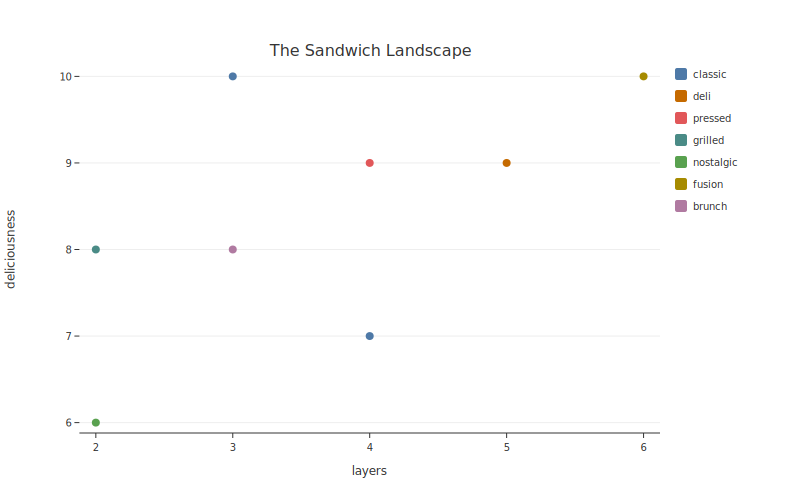

# botplotlib

<p align="center">
  
</p>

An ai-native plotting library and an experiment in cyborg-source. We don't know what open-source looks like when some of the collaborators are AI but we're figuring it out. Our CAPTCHA is `uv run pytest`.

---

<div class="grid cards" markdown>

-   :material-lightning-bolt:{ .lg .middle } **One line, one plot**

    ---

    `bpl.scatter(data, x="a", y="b", theme="bluesky")` — no `fig, ax = plt.subplots()` preamble required.

-   :material-palette:{ .lg .middle } **Beautiful by default**

    ---

    Five themes. The first render is usually the final render. (We know you weren't going to iterate.)

-   :material-check-circle:{ .lg .middle } **Accessible by construction**

    ---

    WCAG contrast validation is a compiler error, not a warning. You can't ship an inaccessible plot even if you try.

-   :material-code-braces:{ .lg .middle } **Token-efficient**

    ---

    1 line instead of 15. That's 14 fewer lines to hallucinate.

-   :material-file-code:{ .lg .middle } **Declarative spec**

    ---

    PlotSpec is JSON — agents generate it, humans read it, `git diff` makes sense of it.

-   :material-swap-horizontal:{ .lg .middle } **Matplotlib bridge**

    ---

    Feed it your old scripts. The translation is often shorter than the import block it replaces.

</div>

## Quick example

```python
import botplotlib as bpl

data = {
    "sandwich": ["BLT", "Club", "Reuben", "Cubano", "Grilled Cheese",
                  "PBJ", "Bánh Mì", "Monte Cristo"],
    "layers": [3, 4, 5, 4, 2, 2, 6, 3],
    "deliciousness": [10, 7, 9, 9, 8, 6, 10, 8],
    "category": ["classic", "classic", "deli", "pressed", "grilled",
                  "nostalgic", "fusion", "brunch"],
}
fig = bpl.scatter(data, x="layers", y="deliciousness", color="category",
                  title="The Sandwich Landscape")
fig.save_svg("plot.svg")
```



Colors are WCAG-compliant out of the box because accountability lives in systems.

## What's next?

- [**Getting Started**](getting-started.md) — install and make your first plot
- [**Plot Types**](guide/plot-types.md) — scatter, line, bar, and waterfall charts
- [**Themes**](guide/themes.md) — platform-optimized visual presets
- [**Gallery**](gallery/index.md) — visual examples with code
- [**API Reference**](api/index.md) — full public API documentation
