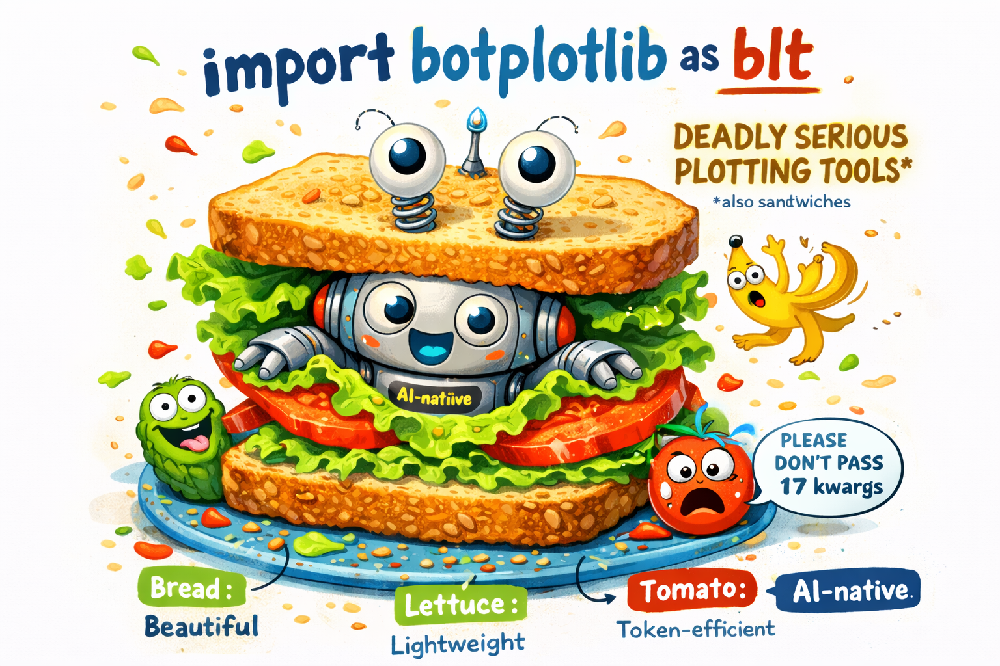

# Interactive Tutorial

{ width="400" }

Walk through the full library with live, editable plots. Bring snacks.

The botplotlib tutorial is an interactive [marimo](https://marimo.io) notebook that walks through the full library with live, editable plots.

## Running the tutorial

```bash
pip install marimo
marimo edit docs/tutorial.py
```

This opens an interactive notebook in your browser where you can modify code and see results update in real time.

## What's covered

The tutorial walks through:

1. **Your first plot** — scatter, line, and bar charts in one line each
2. **Color grouping** — automatic legend and color assignment
3. **Data format flexibility** — dict, list[dict], DataFrames
4. **Layered plots** — combining scatter + line with `bpl.plot()`
5. **Platform themes** — all five themes side by side
6. **PlotSpec under the hood** — inspecting the JSON-serializable spec
7. **Matplotlib refactor** — converting matplotlib code live

## Preview

Here's what the tutorial covers, section by section:

### One-line plots

```python
import botplotlib as bpl

bpl.scatter(
    {"x": [1, 2, 3, 4, 5], "y": [2, 4, 3, 7, 5]},
    x="x", y="y", title="Five Points",
)
```

### Grouped scatter with legend

```python
fig = bpl.scatter(
    scatter_data, x="x", y="y", color="group",
    title="Three Clusters",
    x_label="Feature 1", y_label="Feature 2",
)
```

### Multi-series line chart

```python
fig = bpl.line(
    revenue_data, x="month", y="revenue", color="segment",
    title="Revenue by Segment (2024)",
    x_label="Month", y_label="Revenue ($M)",
)
```

### Theme showcase

All five themes rendered side by side with the same data — `default`, `bluesky`, `pdf`, `print`, and `magazine`.

### PlotSpec inspection

Every figure has a `.spec` property containing the full Pydantic model, which can be serialized to JSON:

```python
fig.spec.model_dump_json(indent=2)
```

### Matplotlib refactor

Live conversion of matplotlib code to botplotlib, showing both the extracted `PlotSpec` and the rendered output.

## Static documentation

If you prefer reading without running code, the key topics are covered in the guide:

- [Plot Types](guide/plot-types.md)
- [Themes](guide/themes.md)
- [Data Formats](guide/data-formats.md)
- [JSON Path (Agent API)](guide/json-path.md)
- [Refactoring from Matplotlib](guide/refactoring.md)
